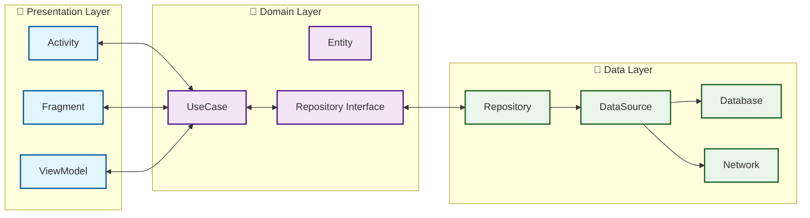

# 🎭 eMogi - AI 캐릭터 소셜 플랫폼

> **Google Play Store 배포 완료**,
> AI 캐릭터와 자연스러운 대화를 나눌 수 있는 안드로이드 앱

# 📱 다운로드
Google Play Store: [다운로드](https://play.google.com/store/apps/details?id=com.meta.emogi)

## 📱 프로젝트 개요

eMogi는 사용자가 다양한 AI 캐릭터와 개인화된 대화를 나눌 수 있는 소셜 플랫폼입니다. 
실제 친구와 대화하는 듯한 자연스러운 경험을 제공하며, 사용자의 관심사를 학습하여 점점 더 친밀한 관계를 형성합니다.

## 🛠 기술 스택

### **언어 & 프레임워크**
- **Java** (메인 개발 언어)
- **Kotlin** (점진적 마이그레이션 중)
- **Android SDK** (Target SDK 34)

### **아키텍처 & 디자인 패턴**
- **MVVM Architecture** 
- **Dependency Injection** 

### **데이터베이스 & 스토리지**
- **SharedPreferences** (로그인 설정)

### **네트워킹 & API**
- **Retrofit2** (REST API 통신)
- **OkHttp3** (채팅방 웹소켓 구현)
- **Gson** (JSON 데이터 파싱)

### **UI/UX**
- **ViewBinding** (뷰 바인딩)
- **RecyclerView** 
- **Navigation Component**

## ✨ 주요 기능

### 🎨 **캐릭터 시스템**
- **캐릭터 랭킹 조회**: 인기 캐릭터 순위 확인
- **내 캐릭터 관리**: 개인 캐릭터 생성 및 커스터마이징
- **캐릭터 프로필**: 상세 정보 및 특성 관리
- **캐릭터 사용 수정**: 개인 취향 반영

### 👤 **사용자 관리**
- **구글 소셜 로그인** (OAuth 2.0)
- **프로필 관리**: 계정 정보 및 닉네임 설정

### 💬 **대화 시스템**
- **실시간 채팅**: WebSocket 기반 즉시 응답
- **대화 내역 관리**: 과거 대화 저장 및 검색
- **캐릭터별 대화방**: 독립적인 대화 공간

## 🏗 시스템 아키텍처 (작업중)

## 📈 성과 및 지표

### **배포 성과**
- ✅ **Google Play Store 정식 출시**
- ✅ **프로덕션 환경 운영**
- 📊 **사용자 수**: 100명 내외
- 📊 **평점**: 5.0

### **기술적 성과**
- 🔒 **보안 강화**: OAuth 2.0 및 JWT 토큰 기반 인증 시스템 구축

## 🔧 주요 기술 구현

### **1. MVVM 아키텍처 구현**
- ViewModel과 LiveData 패턴으로 UI와 비즈니스 로직 분리
- ViewBinding을 활용한 안전한 뷰 참조
- Navigation Component를 통한 Fragment 간 데이터 전달

### **2. 실시간 채팅 구현**
- OkHttp3 WebSocket을 활용한 실시간 양방향 통신
- 메시지 상태 추적 (전송중/전송완료)
- RecyclerView를 통한 효율적인 채팅 UI 구현

### **3. Repository 패턴 적용**
- Retrofit2와 Gson을 활용한 서버 통신
- Interceptor를 통한 공통 헤더 및 에러 처리
- 비동기 처리를 위한 Callback 패턴 적용

### **4사용자 인증 시스템**
- Google OAuth 2.0 소셜 로그인 구현
- JWT 토큰 기반 인증 및 자동 갱신
- SharedPreferences를 활용한 로그인 상태 유지

## 🚀 개발 과정에서 해결한 주요 문제

### **1. 네트워크 예외 처리**
**문제**: API 호출 실패 시 앱 크래시  
**해결**: Retrofit Interceptor에서 공통 에러 처리 및 재시도 로직 구현

### **2. WebSocket 연결 안정성**
**문제**: 네트워크 불안정 시 채팅 연결 끊김
**해결**: 자동 재연결 로직 및 연결 상태 모니터링 구현

### **3. RecyclerView 성능 최적화**
**문제**: 대화 내역이 많을 때 스크롤 지연 발생
**해결**: ViewHolder 패턴 적용 및 이미지 지연 로딩으로 성능 개선

## 🔮 향후 개발 계획

- [ ] **Kotlin 완전 마이그레이션** (현재 40% 진행)
- [ ] **Jetpack Compose** 도입 검토
- [ ] **Multi-module Architecture** 적용
- [ ] **CI/CD 파이프라인** 구축 (GitHub Actions)

## 📊 코드 품질

- MVVM 아키텍처 패턴 적용
- ViewBinding 사용으로 null safety 확보
- Retrofit Interceptor를 통한 공통 에러 처리
- Google Play Console 크래시 리포트 모니터링

## 🎯 학습 및 성장

이 프로젝트를 통해 다음과 같은 역량을 키웠습니다:

- MVVM 아키텍처 설계 및 구현 경험
- Google Play Console 배포 및 운영 관리
- WebSocket 실시간 통신 구현
- OAuth 2.0 소셜 로그인 시스템 구축
- RESTful API 설계 및 연동

---

*이 프로젝트는 개인 포트폴리오용으로 개발되었으며, 지속적으로 개선해 나가고 있습니다.*
